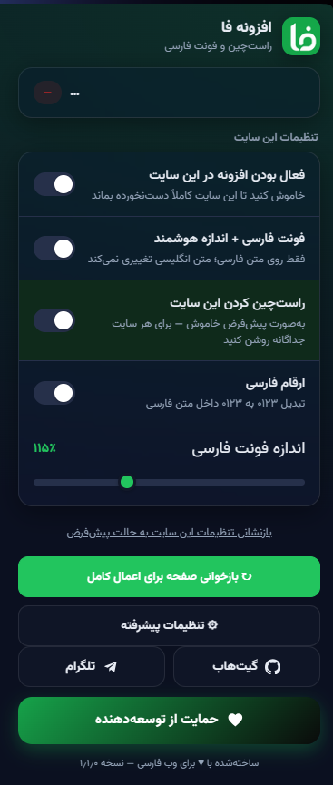
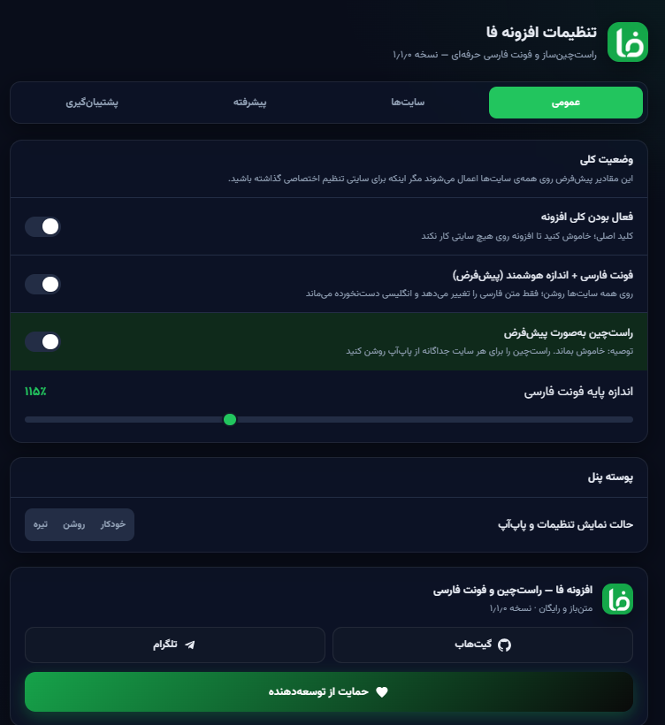

<div align="center">

# فا | راست‌چین‌ساز و فونت فارسی
### FA | Persian Font & RTL Extension for Chrome

افزونه‌ی مرورگر کروم (Manifest V3) برای اعمال فونت فارسی **وزیرمتن**، اندازه‌ی هوشمند، و راست‌چینِ اختیاریِ هر سایت روی متن صفحات وب.

A Manifest V3 Chrome extension that applies the **Vazirmatn** Persian font, smart per‑element sizing, and optional per‑site RTL to web page text.

[](https://github.com/ArmanAZ44/FA_Persian_Extension)
[](https://t.me/ArmanAZPC)


</div>

### 🖼️ پیش‌نمایش / Preview

<p align="center">
  
  &nbsp;&nbsp;
  
</p>

---

## 🇮🇷 فارسی

### ✨ ویژگی‌ها
- **فونت فارسی هوشمند:** فونت وزیرمتن فقط روی بخش‌های فارسیِ متن اعمال می‌شود؛ **متن انگلیسی سایت هرگز تغییر نمی‌کند.**
- **اندازه‌ی هوشمند:** اندازه‌ی فونت فارسی بر اساس نوع عنصر (تیتر، پاراگراف، دکمه و …) تنظیم می‌شود تا هماهنگ دیده شود.
- **راست‌چین هر سایت:** راست‌چین به‌صورت پیش‌فرض خاموش است و برای هر سایت جداگانه از پاپ‌آپ روشن می‌شود.
- **حین تایپ:** فونت و راست‌چین در فیلدهای فرم و ویرایشگرهای متنی (contenteditable) هم اعمال می‌شود (ویرایشگرهای کد استثنا هستند).
- **دیکشنری هاور (جدید):** کلید `Alt` را نگه دارید و روی هر کلمه‌ی انگلیسی صفحه بروید تا معنی فارسی سریع آن نمایش داده شود؛ کاملاً آفلاین، بدون هیچ درخواست اینترنتی. از تنظیمات پیشرفته قابل خاموش‌کردن است.
- **تنظیمات اختصاصی هر دامنه، ارقام فارسی، اصلاح فاصله‌ها، تایپوگرافی و ترجمه‌ی سریع.**
- دامنه‌های `.ir` و همچنین فهرستی گسترده از سایت‌های شناخته‌شده‌ی ایرانی/فارسی‌زبان با دامنه‌ی غیر `.ir` (بیش از ۶۰ هزار دامنه) به‌طور خودکار مستثنا هستند، چون از قبل فونت/راست‌چین مناسب خودشان را دارند.
- **حالت سازگاری اختصاصی با ChatGPT (با رندر تدریجی):** روی `chatgpt.com` و `chat.openai.com` افزونه به‌جای موتور عمومی، از یک مسیر کاملاً غیرتهاجمی و فقط-CSS استفاده می‌کند. فونت فارسی دیگر منتظر پایان کامل پاسخ نمی‌ماند؛ همان‌طور که ChatGPT پاسخ را استریم می‌کند، هر بخش (پاراگراف/آیتم) به‌محض آماده‌شدن به‌صورت تدریجی و بدون فلیکر فونت می‌گیرد.
- **حالت سازگاری اختصاصی با Kick.com:** برای جلوگیری از گیرکردن Kick روی صفحه‌ی لودینگ یا نیاز به رفرش‌های مکرر، افزونه پردازش را تا اتمام کامل لود صفحه به تعویق می‌اندازد و فقط عناصر واقعاً مرئی را لمس می‌کند.

### 🆕 تغییرات نسخه‌ی ۱٫۳٫۲
- **پیش‌فرض هوشمند برای Kick.com:** پیش‌تر راست‌چین روی همه‌ی سایت‌ها (ازجمله Kick) به‌صورت پیش‌فرض خاموش بود و کاربر باید هر بار دستی از پاپ‌آپ روشنش می‌کرد. حالا یک لایه‌ی جدید «پیش‌فرض‌های پیشنهادی هر دامنه» به هسته‌ی `exclusions.js` اضافه شد؛ Kick.com اولین عضو این فهرست است و از همان اولین بازدید، بدون هیچ کاری از طرف کاربر، راست‌چین/ترجمه‌شده نمایش داده می‌شود. اگر کاربر خودش دستی تنظیم دیگری برای Kick انتخاب کند، همان انتخاب کاربر همیشه اولویت دارد؛ این پیش‌فرض فقط وقتی اعمال می‌شود که override دستی‌ای ثبت نشده باشد.
- پاپ‌آپ حالا وقتی سایت جاری یکی از این پیش‌فرض‌های پیشنهادی را دارد و کاربر هنوز override نساخته، یک نوار اطلاع‌رسانی سبزرنگ نشان می‌دهد.

### 🆕 تغییرات نسخه‌ی ۱٫۳٫۰
- **رندر تدریجی (Incremental) روی ChatGPT:** فونت فارسی دیگر منتظر پایان کامل پاسخ نمی‌ماند و باعث یک پرش ناگهانی در انتها نمی‌شود. به‌محض این‌که یک بخش از پیام (مثل یک پاراگراف یا آیتم لیست) در حین استریم برای مدت کوتاهی بدون تغییر بماند، همان بخش — نه کل پیام — با یک attribute مشخص و فونت‌دار می‌شود. بخش‌های قبلاً پردازش‌شده هرگز دوباره لمس نمی‌شوند و کل پیام هرگز یک‌جا rescan نمی‌شود. تمام کار از طریق تزریق کلاس/attribute CSS انجام می‌شود، بدون `innerHTML`/`textContent`، بدون دست‌کاری رندر React. بلوک‌های کد، جدول‌ها، فرمول‌های ریاضی (KaTeX) و کادر نوشتن پیام همیشه دست‌نخورده و LTR باقی می‌مانند.
- **حالت سازگاری ChatGPT (پایه):** راست‌چین و فونت فارسی روی `chatgpt.com`/`chat.openai.com` فقط از طریق CSS اعمال می‌شود. هر پیام فقط یک‌بار و فقط پس از «سکوت» کامل متن (پایان استریم) به‌طور نهایی با یک attribute مشخص می‌شود.
- **رفع باگ لود Kick.com:** قبلاً روشن‌بودن افزونه گاهی باعث می‌شد Kick با صفحه‌ی سفید یا لودینگ گیر بماند و به چند بار رفرش نیاز داشت. حالا یک «حالت سازگاری» اختصاصی برای `kick.com` اضافه شده که: هیچ DOM/CSS ای را پیش از اتمام کامل لود صفحه دست‌کاری نمی‌کند؛ در طول hydration اولیه‌ی React هیچ `MutationObserver` ای فعال نیست؛ کل سند در startup اسکن نمی‌شود و فقط عناصر واقعاً مرئی و کاملاً رندرشده پردازش می‌شوند؛ اسکلتون‌ها/placeholder های موقت هرگز لمس نمی‌شوند؛ و بعد از لود اولیه یک observer سبک و debounce‌شده (بدون `characterData`، فقط `childList`) جایگزین می‌شود که ناوبری داخلی (`pushState`/`replaceState`) را هم بدون نیاز به رفرش دستی پوشش می‌دهد.
- **افزودن هزاران سایت جدید به فهرست استثناها:** فهرست دامنه‌های فارسی‌زبانی که افزونه روی آن‌ها اعمال نمی‌شود، از چند ده مورد به بیش از ۶۰ هزار دامنه‌ی غیر `.ir` گسترش یافت (علاوه بر پوشش کامل همه‌ی دامنه‌های `.ir`). این فهرست در فایل جداگانه‌ی `excluded-domains-data.js` نگه‌داری می‌شود تا `exclusions.js` خوانا بماند.
- **بهبود عملکرد تشخیص استثنا:** به‌جای پیمایش خطی فهرست بزرگ دامنه‌ها، اکنون از یک `Set` و کندن لیبل‌های زیردامنه استفاده می‌شود؛ زمان بررسی هر صفحه مستقل از تعداد دامنه‌های فهرست و ثابت (O(depth)) است.

### 🆕 تغییرات نسخه‌ی ۱٫۲٫۰
- رفع باگ «متن ناقص می‌ماند»: پردازش هر گره‌ی متنی و هر mutation جدا ایزوله شد؛ حالا خطای یک مورد مانع اعمال فونت/راست‌چین روی بقیه‌ی متن صفحه (به‌خصوص در سایت‌های داینامیک/SPA) نمی‌شود.
- رفع باگ «سایت لود نمی‌شود / ارور می‌خورد»: اسکریپت روی سندهای غیر HTML (XML، PDF viewer داخلی و…) دیگر اجرا نمی‌شود و در برابر خطای «Extension context invalidated» (بعد از ری‌لود افزونه) مقاوم شد.
- افزودن فهرست سایت‌های ایرانی با هاست داخلی و دامنه‌ی غیر `.ir` به لیست مستثناها.
- افزودن ویژگی جدید: دیکشنری هاور (Alt + هاور روی کلمه‌ی انگلیسی).

### 🧩 نصب دستی روی کروم (حالت توسعه‌دهنده)
1. فایل ZIP افزونه را دانلود و **از حالت فشرده خارج کنید** (Extract) تا یک پوشه به‌دست آید (پوشه باید شامل `manifest.json` باشد).
2. در کروم به آدرس زیر بروید:
   ```
   chrome://extensions
   ```
3. از گوشه‌ی بالا‑راست، **حالت توسعه‌دهنده (Developer mode)** را روشن کنید.
4. روی **«بارگذاری افزونهٔ باز‑شده» (Load unpacked)** کلیک کنید.
5. **پوشه‌ی اکسترکت‌شده** (همان پوشه‌ای که `manifest.json` داخلش است) را انتخاب کنید.
6. تمام! آیکون «ف» را در نوار افزونه‌ها می‌بینید. برای تنظیمات هر سایت روی آن کلیک کنید.

> نکته: اگر پوشه‌ی اشتباه (مثلاً پوشه‌ی والد) را انتخاب کنید، خطای «Manifest file is missing or unreadable» می‌گیرید. حتماً پوشه‌ای را انتخاب کنید که `manifest.json` مستقیماً داخل آن است.

### ⌨️ میانبرها
- `Alt+Shift+F` → روشن/خاموش کردن کلی افزونه
- `Alt+Shift+S` → روشن/خاموش کردن راست‌چین در سایت جاری
- `Alt+Shift+T` → ترجمه‌ی سریع متن انتخاب‌شده (در صورت فعال بودن)

### 🔄 به‌روزرسانی
پس از دریافت نسخه‌ی جدید، فایل‌ها را جایگزین کنید و در صفحه‌ی `chrome://extensions` روی دکمه‌ی **↻ (Reload)** افزونه بزنید.

---

## 🇬🇧 English

### ✨ Features
- **Smart Persian font:** Vazirmatn is applied only to the Persian parts of the text — the site's **English text is never changed.**
- **Smart sizing:** Persian font size is tuned per element type (heading, paragraph, button, …) for visual balance.
- **Per‑site RTL:** RTL is off by default and enabled per website from the popup.
- **While typing:** font and RTL also apply inside form fields and rich‑text (contenteditable) editors — code editors are excluded.
- **Per‑domain overrides, Persian digits, spacing fixes, typography, and quick translate.**
- `.ir` domains — plus a large curated list of well‑known Iranian/Persian sites hosted under non‑`.ir` TLDs (60,000+ domains) — are auto‑excluded.
- **Dedicated ChatGPT compatibility mode with incremental rendering:** on `chatgpt.com` and `chat.openai.com` the extension uses a completely non‑destructive, CSS‑only path. The Persian font no longer waits for the whole response to finish — as ChatGPT streams its answer, each finished chunk (paragraph/list item) gets the font applied progressively, without flicker.
- **Dedicated Kick.com compatibility mode:** to stop Kick from getting stuck loading or needing repeated refreshes, the extension defers all processing until the page has fully loaded and only ever touches elements that are actually visible.

### 🆕 What's new in 1.3.2
- **Kick.com is RTL by default now:** a new "recommended site defaults" layer in `exclusions.js` ships with `kick.com → { rtl: true }`, so the site shows up right‑to‑left/Persian the very first time you open it — no need to flip anything in the popup. Your own manual choice for the site always wins if you ever change it.
- **Near‑live, low‑latency processing on Kick:** the compatibility mode no longer waits for the heavy `window.load` event; it now only waits for the HTML parse to finish (`DOMContentLoaded`) plus two render frames, then starts scanning. The live‑chat observer's debounce also dropped from 400ms to 60ms, so new chat messages get RTL applied almost instantly instead of in visible batches — closer to Kick's own live feel and unlike the deliberately slower, stream‑aware ChatGPT mode.

### 🆕 What's new in 1.3.0
- **Incremental rendering on ChatGPT:** the Persian font no longer waits for the entire response to finish, so text no longer suddenly changes at the end. As soon as a piece of the message (a paragraph or list item) goes quiet for a short moment during streaming, that piece — not the whole message — gets marked with a data attribute and the font applied. Already‑processed pieces are never touched again, and the full message is never rescanned. Everything happens through CSS class/attribute injection — no `innerHTML`/`textContent` replacement, and React's own rendering is left completely untouched. Code blocks, tables, math (KaTeX), and the composer always stay untouched and LTR.
- **ChatGPT compatibility mode (baseline):** RTL and the Persian font on `chatgpt.com`/`chat.openai.com` are applied purely through CSS. Each full message is also marked exactly once with a data attribute after its text has been quiet for a short debounce window (i.e. streaming has finished), as a safety net on top of incremental rendering.
- **Fixed Kick.com loading issue:** previously, having the extension enabled could sometimes make Kick get stuck on a blank or loading page, requiring multiple refreshes. A dedicated `kick.com` compatibility mode was added that: never touches any DOM/CSS before the page has fully finished loading; runs no `MutationObserver` at all during React's initial hydration; never scans the whole document on startup and only processes elements that are actually visible and fully rendered; never touches loading placeholders or skeleton screens; and, after the initial load, switches to a lightweight, debounced observer (`childList` only, no `characterData`) that also covers client‑side navigation (`pushState`/`replaceState`) without requiring a manual refresh.
- **Thousands of new excluded sites:** the list of Persian‑language domains the extension never touches grew from a few dozen entries to 60,000+ non‑`.ir` domains (on top of full `.ir` TLD coverage). The list now lives in a separate `excluded-domains-data.js` file to keep `exclusions.js` readable.
- **Faster exclusion lookup:** domain matching now uses a `Set` with subdomain‑label stripping instead of a linear scan, so checking a page's host stays O(depth) regardless of how large the exclusion list grows.

### 🆕 What's new in 1.2.0
- Fixed "text stays incomplete": per‑node and per‑mutation processing is now isolated in try/catch, so one failing node no longer stops font/RTL from being applied to the rest of the page (especially on dynamic/SPA sites).
- Fixed "site won't load / throws an error": the script now bails out on non‑HTML documents (XML, the built‑in PDF viewer, etc.) and is resilient to "Extension context invalidated" errors after a reload/update.
- Added a curated list of Iranian sites hosted domestically under non‑`.ir` domains to the exclusion list.
- New feature: Hover Dictionary (hold Alt + hover an English word for an instant Persian meaning).

### 🧩 Manual install on Chrome (Developer mode)
1. Download the extension ZIP and **extract it** into a folder (the folder must contain `manifest.json`).
2. Open Chrome and go to:
   ```
   chrome://extensions
   ```
3. Turn on **Developer mode** (top‑right toggle).
4. Click **Load unpacked**.
5. Select the **extracted folder** (the one that directly contains `manifest.json`).
6. Done! The "ف" icon appears in the toolbar. Click it to configure each site.

> Tip: Selecting the wrong folder (e.g. a parent folder) causes a "Manifest file is missing or unreadable" error. Make sure the folder you pick has `manifest.json` directly inside it.

### ⌨️ Shortcuts
- `Alt+Shift+F` → toggle the whole extension
- `Alt+Shift+S` → toggle RTL on the current site
- `Alt+Shift+T` → quick‑translate the selected text (if enabled)

### 🔄 Updating
After getting a new build, replace the files and click the **↻ Reload** button on the extension card in `chrome://extensions`.

---

## 🔗 Links / پیوندها
- **GitHub:** https://github.com/ArmanAZ44/FA_Persian_Extension
- **Telegram:** https://t.me/ArmanAZPC
- **حمایت / Support:** https://reymit.ir/armanaz44

## 📄 License / مجوز
Free & open source. فونت وزیرمتن تحت مجوز OFL منتشر شده است / Vazirmatn font is licensed under the SIL OFL.

<div align="center">
ساخته‌شده با ♥ برای وب فارسی — Made with ♥ for the Persian web
</div>
